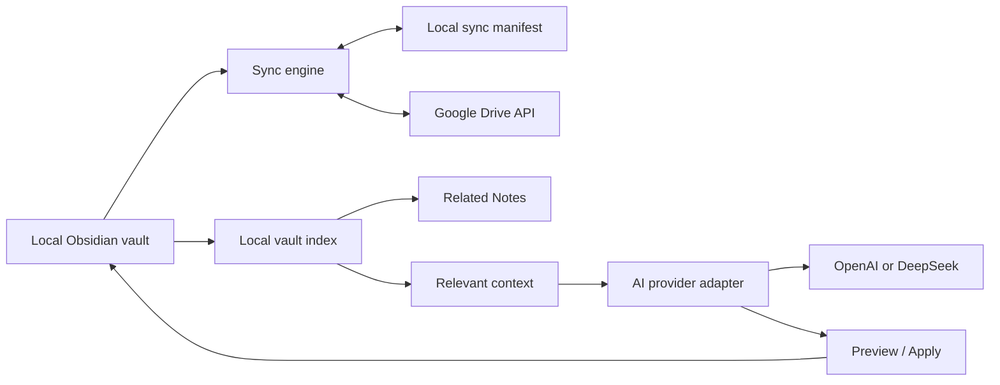

# Second Brain Obsidian Plugin — Design Specification

**Date:** 2026-08-23  
**Status:** Design approved in conversation; awaiting written-spec review  
**Scope:** Private/personal v1 for desktop and laptop, with responsive UI down to mobile width

## 1. Goal

Build an Obsidian plugin that helps the user capture and organize notes, search the full vault, surface related notes, and use AI on demand. Each device keeps a local vault. The plugin synchronizes user files to one Google Drive folder through the Google Drive API.

The local vault remains the working source of truth. Google Drive is a shared mirror used to move changes between devices.

## 2. Version 1 scope

Included:

- Two-way sync for Markdown, images, PDFs, and other user files in the vault.
- Automatic sync at startup, after debounced file changes, periodically, and through **Sync Now**.
- Automatic conflict copies when both local and remote versions changed.
- Local vault search and a local Related Notes panel.
- **Explain relation** as an on-demand AI action.
- AI commands: **Ask Vault**, **Summarize Note**, **Extract Structure**, and **Create Note from Prompt**.
- Preview/diff before AI writes or creates a note.
- OpenAI and DeepSeek providers, with provider-specific API keys and models.
- Responsive desktop and mobile-width layouts; the native Obsidian editor remains the writing surface.

Out of scope for v1:

- A hosted backend or server-side storage.
- Automatic AI calls whenever a note changes.
- Automatic semantic embeddings/vector database.
- Community-plugin distribution workflow.
- Multi-vault orchestration or team collaboration.

## 3. Architecture

The plugin is organized around small responsibilities:

- **Sync engine** — coordinates scans, comparisons, uploads, downloads, conflict handling, and status.
- **Google Drive client** — OAuth, folder traversal, file metadata, upload/download, and retryable requests.
- **Local manifest store** — device-local snapshot of path, hash, size, mtime, Drive file ID, and last-sync state.
- **Conflict manager** — creates conflict copies and records a conflict entry without deleting the other version.
- **Vault index** — indexes title, path, headings, tags/frontmatter, links, text, and modification time.
- **AI provider adapter** — normalizes OpenAI, DeepSeek, and later compatible providers behind one interface.
- **AI command service** — builds prompts/context, validates structured results, presents previews, and applies approved changes.
- **Settings/setup UI** — first-run wizard, provider settings, sync settings, credentials, and diagnostics.

## 4. Sync behavior

The plugin excludes `.obsidian`, workspace/cache files, plugin settings, OAuth tokens, and API keys from Drive sync. All other user files, including attachments, are eligible.

Each device stores a last-synced snapshot locally. A sync compares three states: the local file, the remote Drive file, and the last common snapshot.

- Changed only locally → upload.
- Changed only remotely → download.
- New on one side → copy to the other side.
- Changed on both sides → keep the local file in place and write the remote version to `_sync-conflicts/`.
- Binary conflicts → use the same copy rule; no binary merge is attempted.
- Deletion versus edit → preserve the edited version and surface the deletion as a conflict.

Conflict names include the original stem, device/source label, and timestamp. Conflict files are normal user files and are themselves eligible for sync, so both devices can see them.

Sync states are **Synced**, **Syncing**, **Conflict**, **Offline**, and **Auth required**. Network errors use bounded retries and return a visible status. A failed sync never marks a file as synced until the remote operation is confirmed.

Initial sync shows a preview of uploads, downloads, and conflicts before applying the plan. **Sync Now** runs the same plan immediately.

## 5. Search, Related Notes, and AI

The local index is deliberately lightweight for v1. It scores candidates using:

- shared keywords in title, headings, and body;
- shared tags/frontmatter;
- existing inbound/outbound links;
- folder/topic proximity;
- recency as a small tie-breaker.

Related Notes appears automatically when a note is opened or changes. It shows the top five candidates and a short reason such as “shared tags,” “similar heading,” or “linked from two notes.” This does not call AI.

**Explain relation** sends the active note and the selected candidate excerpt to the configured AI provider. The result explains the relationship and may suggest a backlink. Any backlink or note mutation is shown as a preview before **Apply**.

For **Ask Vault**, the local index retrieves the most relevant notes or excerpts first. Only that bounded context is sent to the provider; the full vault is not sent by default. The response includes source note links wherever possible.

AI commands:

- **Ask Vault** — question answering over retrieved vault context.
- **Summarize Note** — summary of the active note.
- **Extract Structure** — proposed tags, tasks, and backlinks.
- **Create Note from Prompt** — creates a draft preview, not an automatic file write.

## 6. AI providers and credentials

Settings expose:

- Provider: OpenAI or DeepSeek.
- Base URL: auto-filled from the provider, editable only for future compatible providers.
- API key: stored locally per device and never uploaded to Drive.
- Model: provider-specific model ID.
- Maximum context size and response length.

OpenAI uses its own API key and endpoint. DeepSeek uses its own key but documents an OpenAI-compatible API format and base URL. The provider adapter handles differences in endpoint and response shape so the rest of the plugin does not depend on one provider.

The plugin must validate AI output before showing an Apply action. If a provider cannot return the requested structure, the command falls back to a clearly labeled text result instead of writing guessed data.

## 7. User experience

Desktop uses an Obsidian-like three-panel layout:

- left: Today, Inbox, Ask Vault, Knowledge Map;
- center: the native Obsidian note editor;
- right: Related Notes and sync status.

Mobile width keeps the native editor primary, moves navigation into a compact header, collapses related notes into a section, and keeps Ask Vault/Summarize/Related as compact actions. The editor is never replaced by a separate plugin editor.

The first-run wizard configures Google Drive, the remote folder, the AI provider, and sync rules. Settings include Re-authenticate, Clear credentials, Pause sync, Sync Now, conflict folder, interval, excluded patterns, and AI context limits.

## 8. Safety and error handling

- No AI write happens without preview and explicit Apply.
- No conflict version is discarded automatically.
- Credentials are device-local and excluded from sync.
- Offline edits remain local and are reconciled on the next successful sync.
- Authentication failures pause the affected integration and request re-authentication.
- Remote deletes are not treated as permission to erase a locally edited file.
- Status messages include enough path/context to diagnose a failed operation without exposing API keys.

## 9. Verification plan

Unit tests cover path filtering, hashing, three-way change classification, conflict naming, deletion-vs-edit handling, index scoring, and AI result validation.

Integration tests use fake Drive and fake provider clients. They cover initial sync, upload/download, retry, offline recovery, duplicate conflict creation, and provider switching without live credentials.

Manual checks cover:

- desktop and mobile-width layouts;
- writing in the native editor while Related Notes updates;
- two devices editing the same Markdown file;
- binary attachment conflict;
- offline editing and recovery;
- Google re-authentication;
- OpenAI and DeepSeek configuration;
- Ask Vault source links;
- preview/apply and cancellation for every AI mutation.

## 10. Acceptance criteria

The v1 design is successful when a user can install/configure the plugin on two devices, select one Drive folder, write normally in Obsidian, see changes sync automatically, recover both versions of a conflict, search the full vault, receive automatic local Related Notes, and use Explain relation or other AI actions only after explicitly requesting them and approving any file changes.
